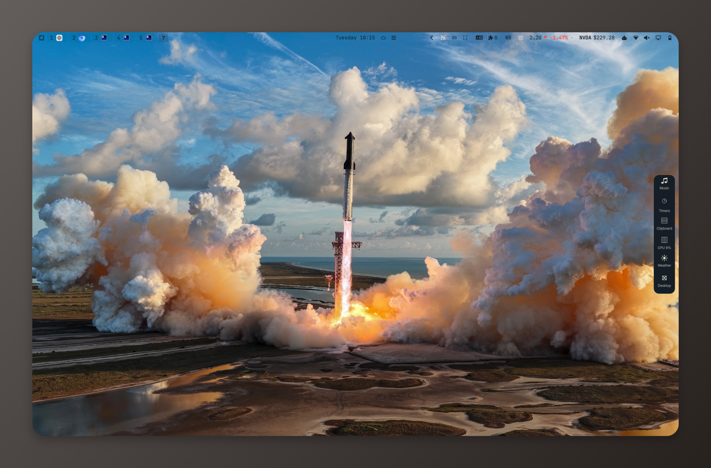
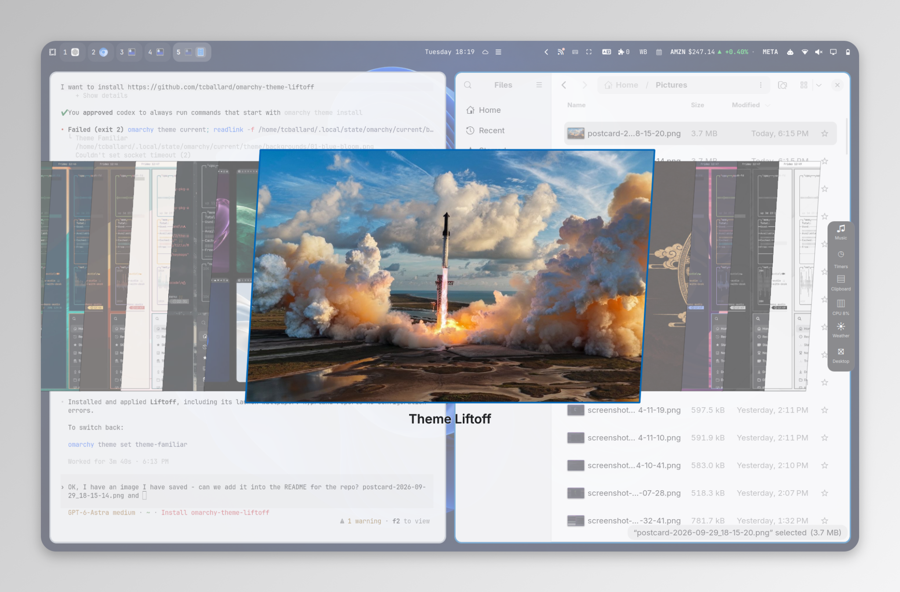

<h1 align="center">Liftoff</h1>

<p align="center"><strong>A little rocket fire for your Omarchy desktop.</strong></p>

<p align="center">
  <a href="https://github.com/tcballard/omarchy-badges"></a>
</p>

Liftoff is a dark theme for Omarchy Quattro inspired by a SpaceX launch. Blue-charcoal surfaces, warm cloud-white text and exhaust-amber accents bring the photograph's colours across your desktop.

Liftoff includes two lossless 8K wallpapers, each enhanced in two passes:

- Launchpad view: **8192 × 4608** (`backgrounds/01-liftoff.png`).
- Engine-cluster view: **8192 × 5461** (`backgrounds/02-engine-cluster.png`).

Fine detail is AI-reconstructed; see [artwork and attribution](CREDITS.md). Choose either wallpaper through Omarchy’s wallpaper picker. The desktop screenshots below show the earlier launchpad wallpaper.



## Try it

```sh
omarchy theme install https://github.com/tcballard/omarchy-theme-liftoff
```

The installer applies the theme immediately and can replace an existing installed copy. Before installing, note your current theme and wallpaper and back up any local changes to Liftoff. To switch back, select your previous theme and wallpaper through Omarchy's pickers; restore your backup if needed.

## From launchpad to desktop

Dark blue surfaces keep the interface quiet around the launch photograph. Amber highlights mark the active window and accents, while sky blue, coastal cyan and soft green carry through the terminal palette. Omarchy's templates apply the colours to supported apps.

Found something hard to read or out of place? [Open an issue](https://github.com/tcballard/omarchy-theme-liftoff/issues) with a screenshot.

This is a development preview targeting Omarchy Quattro. Portable checks passed. The screenshots above show Liftoff on Tom’s desktop and in the theme picker; the installed Omarchy version was not recorded. The upstream registry validator passed on 30 September 2026 with no errors; full live checks and marketplace approval remain pending. The Rust helper and automated handoff were not run because Cargo was unavailable; manual handoff checks were completed. See the [design notes](DESIGN.md) and [validation record](evidence/checks.tsv).

## Theme picker



## Credits and licence

[MIT](LICENSE) © 2026 Tom Ballard, covering the theme configuration and documentation. Launchpad photograph: SpaceX; public-domain status confirmed by the repository author. Engine-cluster photograph supplied by Tom Ballard; its image-specific licence has not been independently verified. Unofficial community theme, not endorsed by SpaceX. [Artwork and attribution](CREDITS.md).
