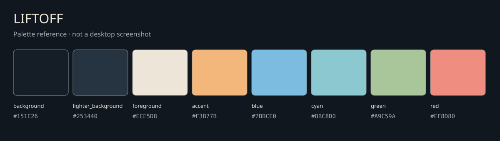

# Liftoff

<p>
  <a href="https://github.com/tcballard/omarchy-badges"></a>
  
  
</p>

Status: development preview
Intended Omarchy target: Quattro, source revision e332dc975d5f635294c497ebb54feb98dc3d89eb
Tested installed Omarchy version: none

The category badge is a community label, not certification. The target is not a tested-version claim.

A dark Omarchy theme inspired by the supplied SpaceX launch photograph. Blue-charcoal surfaces, cloud-white text, exhaust-amber focus and sky-blue terminal colours.



## Install

For local development, copy this directory to an unused
`~/.config/omarchy/themes/liftoff` and select it from the theme menu.
Before applying, record the current theme and background and back up any existing
destination. Do not overwrite a modified installed copy.
To test the development PR on your XPS:

```sh
test ! -e "$HOME/.config/omarchy/themes/liftoff" && \
  mkdir -p "$HOME/.config/omarchy/themes" && \
  git clone --branch feat/liftoff-theme --single-branch \
    https://github.com/tcballard/omarchy-theme-liftoff.git \
    "$HOME/.config/omarchy/themes/liftoff"
```

Then select Liftoff in the theme menu. This stops if the destination already exists. The repository is https://github.com/tcballard/omarchy-theme-liftoff; these instructions deliberately select the development branch until the PR is merged.

## Rollback

Select the previously recorded theme in the theme menu, restore its recorded
background, and restore any backed-up destination. Remove the development copy
only after switching away from it. These instructions still need live verification.

## Media and credits

The supplied 4096×2304 photograph is included unchanged as the wallpaper. Public redistribution permission is pending: see [credits](CREDITS.md). No real desktop screenshot is available yet. The palette contact sheet above is not a desktop screenshot.

## Validation limits

See [validation evidence](evidence/checks.tsv). Portable TOML, contrast, image-decoding and file/reference checks passed. The Rust helper and automated handoff were NOT RUN because Cargo is unavailable; manual handoff checks were completed.
No live desktop, Git-install or registry acceptance is claimed. Tested installed Omarchy version: none. See [design and live checks](DESIGN.md).
The handoff checker checks file/evidence consistency, not whether recorded commands
were actually executed or the theme looks correct. Review command output and prose.
